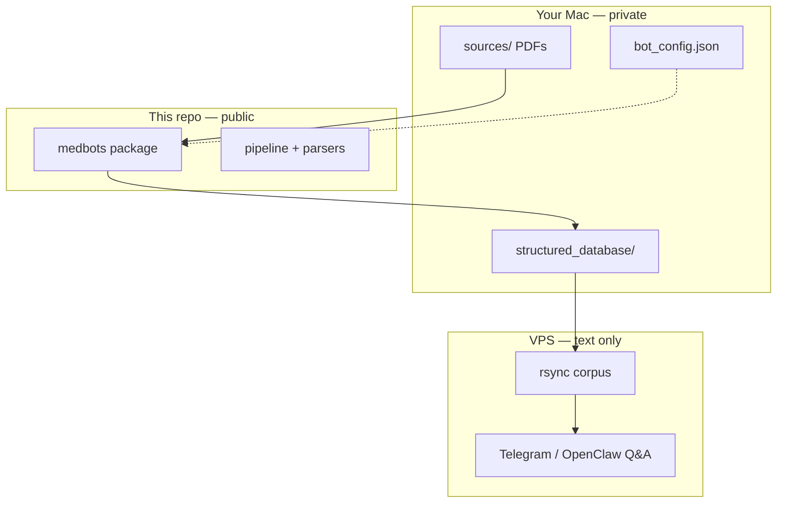

# biohackbot

**Open-source medical corpus pipeline for personal health & biohacking bots**

[English](README.md) · [Русский](README.ru.md) · [中文](README.zh-CN.md)

[](LICENSE)
[](https://www.python.org/downloads/)

**Author:** [Alexey Podobedov](https://github.com/apodobe)

---

Turn scattered lab PDFs into a structured, AI-ready health knowledge base — locally, under your control.

`biohackbot` ships **`medbots-core`**: a Python toolkit to ingest medical documents (EMIAS, Medsi, Gemotest), normalize lab results, validate your corpus, and deploy **text-only** data to a VPS for Telegram / OpenClaw Q&A bots.

> **Not medical advice.** This software organizes *your* documents. It does not diagnose, prescribe, or replace a clinician.

## Why this exists

Most people collect years of lab results across portals, PDFs, and messengers. Generic note apps do not understand Russian lab layouts. LLM chats forget your history. This project gives you:

- **A file-based corpus** (`structured_database/`) that any agent can read
- **Vendor-specific parsers** for common Russian lab formats
- **A repeatable pipeline** after each new PDF drop
- **Clear separation**: public framework code vs. private health data

Your corpus stays **on your machine** (or in a **private** repo). This public repository contains **no patient data**.

## Features

| Area | What you get |
|------|----------------|
| **Ingest** | PyMuPDF text extraction, local parsers for EMIAS / Medsi / Gemotest |
| **Labs** | Normalized rows (`LABS_NORMALIZED.json`), LOINC mapping, deduplication |
| **Pipeline** | Phase-2 enrichment: discrepancies, goals, supplements, corpus index |
| **CLI** | `medbots pipeline`, `medbots patient-dob` |
| **Deploy** | Generic VPS rsync + OpenClaw skill templates (`deploy/`) |
| **Safety** | Pre-push hooks, CI secret scan, corpus path denylist |

## Architecture



## Quick start

```bash
git clone https://github.com/apodobe/biohackbot.git
cd biohackbot
python3 -m venv .venv && source .venv/bin/activate
pip install -e ".[dev]"

# Point to YOUR private corpus (never commit this folder here)
export MEDBOTS_CORPUS_PATH=/path/to/your/structured_database
cp bot_config.example.json /path/to/your-instance/bot_config.json

medbots pipeline --bot-root /path/to/your-instance
pytest
```

### Git hooks (required before push)

```bash
git config core.hooksPath .githooks
chmod +x .githooks/pre-push
```

Hooks block API keys, `.env`, `bot_config.json`, and any `structured_database/` data files from entering this public repo.

## Repository layout

| Path | Purpose |
|------|---------|
| `medbots/` | Core Python package |
| `docs/MED_BOTS_CORPUS_STANDARD.md` | JSON schema & corpus conventions |
| `deploy/` | VPS rsync, OpenClaw skills (templates) |
| `bot_config.example.json` | Feature flags template |
| `structured_database/README.md` | Pointer only — create corpus locally |
| `tests/fixtures/` | Redacted parser golden files |

## Documentation

- [Corpus standard](docs/MED_BOTS_CORPUS_STANDARD.md) — required files, manifest schema, AI read order
- [VPS deploy runbook](deploy/RUNBOOK.md)
- [Security policy](SECURITY.md)
- [Contributing](CONTRIBUTING.md)

## Use as a dependency

Private instance repos can vendor this repo:

```bash
git submodule add https://github.com/apodobe/biohackbot.git vendor/biohackbot
pip install -e vendor/biohackbot
```

## License

[MIT](LICENSE) — Copyright (c) 2026 Alexey Podobedov

Use freely, keep the copyright notice, build something that helps people live better.
