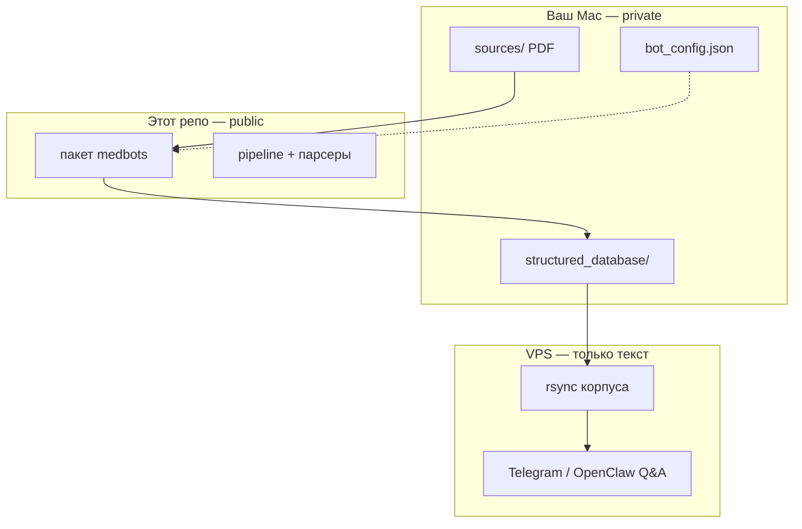

# biohackbot

**Открытый pipeline медицинского корпуса для персональных health / biohacking ботов**

[English](README.md) · [Русский](README.ru.md) · [中文](README.zh-CN.md)

[](LICENSE)
[](https://www.python.org/downloads/)

**Автор:** [Alexey Podobedov](https://github.com/apodobe)

---

Превращает разрозненные PDF с анализами в структурированную базу знаний, готовую для AI — локально, под вашим контролем.

`biohackbot` — это **`medbots-core`**: Python-инструменты для загрузки медицинских документов (ЕМИАС, Медси, Гемотест), нормализации лабораторных показателей, валидации корпуса и выкладки **только текстового** слоя на VPS для Telegram / OpenClaw Q&A ботов.

> **Не является медицинской консультацией.** ПО помогает организовать *ваши* документы. Не ставит диагнозы, не назначает лечение и не заменяет врача.

## Зачем это нужно

Годами копятся анализы в личных кабинетах, PDF и мессенджерах. Обычные заметки не понимают русские бланки лабораторий. Чаты с LLM не помнят вашу историю. Этот проект даёт:

- **Файловый корпус** (`structured_database/`), который может читать любой агент
- **Парсеры под форматы** распространённых российских лабораторий
- **Повторяемый pipeline** после каждой новой пачки PDF
- **Чёткое разделение**: публичный код framework vs. приватные данные о здоровье

Корпус остаётся **у вас** (локально или в **приватном** репозитории). В этом публичном репо **нет данных пациентов**.

## Возможности

| Область | Что есть |
|---------|----------|
| **Ingest** | Извлечение текста PyMuPDF, локальные парсеры EMIAS / Medsi / Gemotest |
| **Анализы** | Нормализованные строки (`LABS_NORMALIZED.json`), LOINC, дедупликация |
| **Pipeline** | Фаза 2: расхождения, цели, добавки, индекс корпуса |
| **CLI** | `medbots pipeline`, `medbots patient-dob` |
| **Деплой** | Шаблоны rsync на VPS + OpenClaw skills (`deploy/`) |
| **Безопасность** | Pre-push hooks, CI secret scan, denylist путей корпуса |

## Архитектура



## Быстрый старт

```bash
git clone https://github.com/apodobe/biohackbot.git
cd biohackbot
python3 -m venv .venv && source .venv/bin/activate
pip install -e ".[dev]"

# Укажите СВОЙ приватный корпус (не коммитьте его в public repo)
export MEDBOTS_CORPUS_PATH=/path/to/your/structured_database
cp bot_config.example.json /path/to/your-instance/bot_config.json

medbots pipeline --bot-root /path/to/your-instance
pytest
```

### Git hooks (перед каждым push)

```bash
git config core.hooksPath .githooks
chmod +x .githooks/pre-push
```

Hooks блокируют API-ключи, `.env`, `bot_config.json` и любые файлы данных из `structured_database/` в этом публичном репозитории.

## Структура репозитория

| Путь | Назначение |
|------|------------|
| `medbots/` | Основной Python-пакет |
| `docs/MED_BOTS_CORPUS_STANDARD.md` | Схема JSON и соглашения корпуса |
| `deploy/` | rsync на VPS, шаблоны OpenClaw skills |
| `bot_config.example.json` | Шаблон feature flags |
| `structured_database/README.md` | Только указатель — корпус создаётся локально |
| `tests/fixtures/` | Редактированные golden-файлы для парсеров |

## Документация

- [Стандарт корпуса](docs/MED_BOTS_CORPUS_STANDARD.md)
- [Runbook деплоя на VPS](deploy/RUNBOOK.md)
- [Политика безопасности](SECURITY.md)
- [Участие в разработке](CONTRIBUTING.md)

## Подключение как зависимость

Приватный instance-репозиторий может подключить этот код через submodule:

```bash
git submodule add https://github.com/apodobe/biohackbot.git vendor/biohackbot
pip install -e vendor/biohackbot
```

## Лицензия

[MIT](LICENSE) — Copyright (c) 2026 Alexey Podobedov

Используйте свободно, сохраняйте copyright, делайте то, что реально помогает людям жить лучше.
