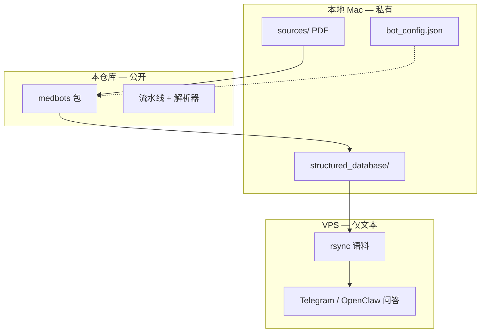

# biohackbot

**面向个人健康与生物黑客 Telegram 机器人的开源医疗语料库流水线**

[English](README.md) · [Русский](README.ru.md) · [中文](README.zh-CN.md)

[](LICENSE)
[](https://www.python.org/downloads/)

**作者：** [Alexey Podobedov](https://github.com/apodobe)

---

将分散的化验 PDF 整理为结构化、可供 AI 读取的健康知识库——在本地运行，数据由您掌控。

`biohackbot` 提供 **`medbots-core`**：用于导入医疗文档（EMIAS、Medsi、Gemotest）、规范化检验结果、校验语料库，并将**纯文本**语料部署到 VPS，供 Telegram / OpenClaw 问答机器人使用。

> **非医疗建议。** 本软件仅帮助整理*您自己的*文档，不提供诊断、处方，不能替代临床医生。

## 项目动机

化验单往往散落在各平台 PDF 与聊天记录中。通用笔记软件无法理解俄语检验单版式，大模型对话也无法长期记住您的病史。本项目提供：

- **基于文件的语料库**（`structured_database/`），任何 Agent 均可读取
- **针对常见俄语检验格式的解析器**
- **可重复执行的流水线**，每次新增 PDF 后一键处理
- **清晰边界**：公开框架代码 vs. 私有健康数据

语料库保存在**您的机器**（或**私有**仓库）。本公开仓库**不包含任何患者数据**。

## 功能概览

| 模块 | 说明 |
|------|------|
| **导入** | PyMuPDF 文本提取，EMIAS / Medsi / Gemotest 本地解析 |
| **检验** | 规范化行（`LABS_NORMALIZED.json`）、LOINC 映射、去重 |
| **流水线** | 第二阶段：差异检测、目标、补剂、语料索引 |
| **CLI** | `medbots pipeline`、`medbots patient-dob` |
| **部署** | VPS rsync 与 OpenClaw Skill 模板（`deploy/`） |
| **安全** | Pre-push 钩子、CI 密钥扫描、语料路径黑名单 |

## 架构



## 快速开始

```bash
git clone https://github.com/apodobe/biohackbot.git
cd biohackbot
python3 -m venv .venv && source .venv/bin/activate
pip install -e ".[dev]"

# 指向您的私有语料库（切勿提交到本公开仓库）
export MEDBOTS_CORPUS_PATH=/path/to/your/structured_database
cp bot_config.example.json /path/to/your-instance/bot_config.json

medbots pipeline --bot-root /path/to/your-instance
pytest
```

### Git 钩子（推送前必配）

```bash
git config core.hooksPath .githooks
chmod +x .githooks/pre-push
```

钩子会阻止 API 密钥、`.env`、`bot_config.json` 及 `structured_database/` 数据文件进入本公开仓库。

## 目录结构

| 路径 | 用途 |
|------|------|
| `medbots/` | 核心 Python 包 |
| `docs/MED_BOTS_CORPUS_STANDARD.md` | JSON 模式与语料约定 |
| `deploy/` | VPS rsync、OpenClaw Skill 模板 |
| `bot_config.example.json` | 功能开关模板 |
| `structured_database/README.md` | 仅说明——语料库在本地创建 |
| `tests/fixtures/` | 脱敏后的解析器黄金测试文件 |

## 文档

- [语料库标准](docs/MED_BOTS_CORPUS_STANDARD.md)
- [VPS 部署手册](deploy/RUNBOOK.md)
- [安全策略](SECURITY.md)
- [贡献指南](CONTRIBUTING.md)

## 作为依赖引用

私有实例仓库可通过 submodule 引用：

```bash
git submodule add https://github.com/apodobe/biohackbot.git vendor/biohackbot
pip install -e vendor/biohackbot
```

## 许可证

[MIT](LICENSE) — Copyright (c) 2026 Alexey Podobedov

自由使用，保留版权声明，愿它能帮助更多人过上更健康的生活。
