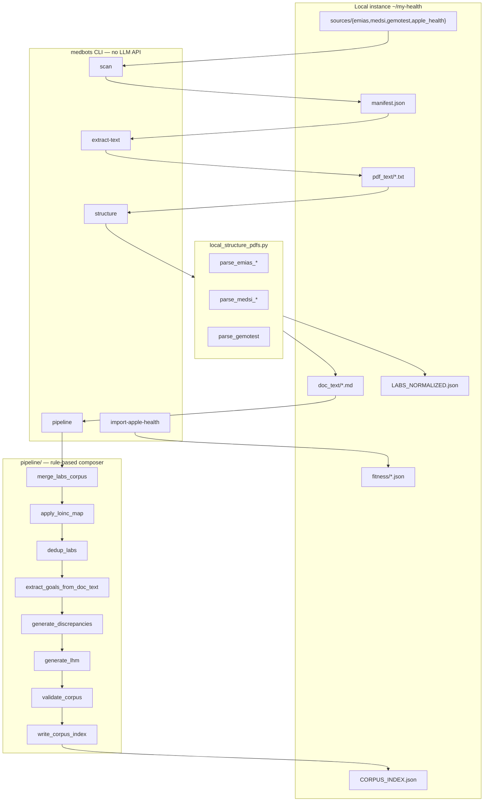
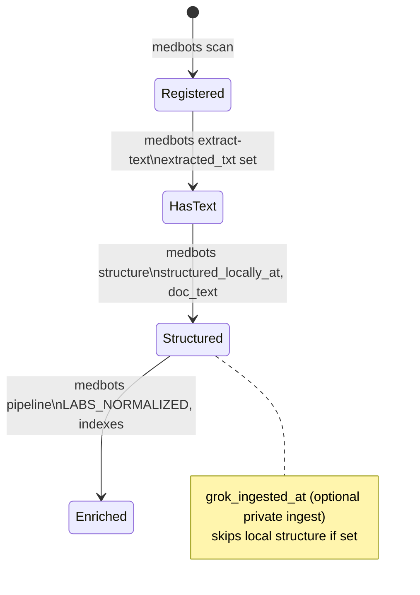

# Architecture

How **biohackbot** (`medbots-core` package, `medbots` CLI) is organized.

## System overview

## Module map

| Path | Role |
|------|------|
| `medbots/cli.py` | User-facing commands |
| `medbots/init_instance.py` | Scaffold private instance |
| `medbots/scan_sources.py` | Register PDFs → `manifest.json` |
| `medbots/extract_pdf_text.py` | PyMuPDF text layer → `pdf_text/` |
| `medbots/local_structure_pdfs.py` | Vendor parsers (EMIAS, Medsi, Gemotest) |
| `medbots/import_apple_health.py` | Stream Apple Health `export.zip` → `fitness/` |
| `medbots/merge_labs_corpus.py` | Re-parse lab rows into `LABS_NORMALIZED.json` |
| `medbots/pipeline/run.py` | Orchestrates post-structure enrichment |
| `medbots/corpus_io.py` | Manifest, paths, patient DOB |
| `medbots/config.py` | `bot_config.json` feature flags |
| `deploy/` | Optional VPS rsync + OpenClaw skill template |

## Manifest entry lifecycle

| Field | Set by | Meaning |
|-------|--------|---------|
| `source_pdf`, `sha256` | scan | Path under instance + content hash |
| `extracted_txt` | extract-text | Relative path in `pdf_text/` |
| `structured_locally_at` | structure | Local parser succeeded |
| `doc_text` | structure | Relative path in `doc_text/` |
| `grok_ingested_at` | optional private Grok ingest | Skips local structure |

## Composer vs LLM

| Layer | What | API calls |
|-------|------|-----------|
| **Local parsers** | `structure`, Apple Health import | None |
| **Composer (pipeline)** | Goals, supplements, protocols, discrepancies drafts — `extracted_by: composer` in JSON meta | None — regex/rules in Python |
| **LLM ingest** | Scanned PDFs without text layer (private `grok_ingest`) | xAI Grok vision/text |
| **LLM Q&A** | OpenClaw agent on VPS reading corpus files | Grok / etc. per deploy config |
| **LLM review** | Human-driven pass on drafts, LHM v2 | User-chosen model — see [LLM_GUIDE.md](LLM_GUIDE.md) |

**Public repo default:** tiers 0–1 only (local + optional manual review). No Grok/Telegram ingest in this repository.

## Adding a new PDF vendor

1. Add `sources/<vendor>/` in `init_instance.py` and `scan_sources.py` (`_VENDORS`).
2. Implement `parse_<vendor>_*` in `local_structure_pdfs.py`.
3. Route in `_parse_entry()` by `source_system` / path.
4. Add golden fixture under `tests/fixtures/pdf_text/` + tests in `tests/test_parse_<vendor>.py`.
5. Document in [PARSERS.md](PARSERS.md).

## Tests and demo

| Asset | Purpose |
|-------|---------|
| `tests/fixtures/pdf_text/` | Synthetic extracts for unit tests |
| `examples/demo-instance/` | Runnable corpus without PDF binaries |
| `tests/test_demo_instance.py` | E2E structure + pipeline on demo copy |

## Optional VPS path

Only text and JSON are synced — no PDFs. See [deploy/RUNBOOK.md](../deploy/RUNBOOK.md).
